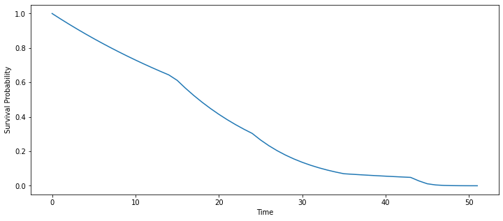

# TorchLife
> Survival Analysis using pytorch


This library takes a deep learning approach to Survival Analysis.

## Install

`pip install torchlife`

## How to use
We need a dataframe that has a column named 't' indicating time, and 'e' indicating a death event.

```
import pandas as pd
import numpy as np
url = "https://raw.githubusercontent.com/CamDavidsonPilon/lifelines/master/lifelines/datasets/rossi.csv"
df = pd.read_csv(url)
df.rename(columns={'week':'t', 'arrest':'e'}, inplace=True)
```

```
df.head()
```


<div>
<style scoped>
    .dataframe tbody tr th:only-of-type {
        vertical-align: middle;
    }

    .dataframe tbody tr th {
        vertical-align: top;
    }

    .dataframe thead th {
        text-align: right;
    }
</style>
<table border="1" class="dataframe">
  <thead>
    <tr style="text-align: right;">
      <th></th>
      <th>t</th>
      <th>e</th>
      <th>fin</th>
      <th>age</th>
      <th>race</th>
      <th>wexp</th>
      <th>mar</th>
      <th>paro</th>
      <th>prio</th>
    </tr>
  </thead>
  <tbody>
    <tr>
      <th>0</th>
      <td>20</td>
      <td>1</td>
      <td>0</td>
      <td>27</td>
      <td>1</td>
      <td>0</td>
      <td>0</td>
      <td>1</td>
      <td>3</td>
    </tr>
    <tr>
      <th>1</th>
      <td>17</td>
      <td>1</td>
      <td>0</td>
      <td>18</td>
      <td>1</td>
      <td>0</td>
      <td>0</td>
      <td>1</td>
      <td>8</td>
    </tr>
    <tr>
      <th>2</th>
      <td>25</td>
      <td>1</td>
      <td>0</td>
      <td>19</td>
      <td>0</td>
      <td>1</td>
      <td>0</td>
      <td>1</td>
      <td>13</td>
    </tr>
    <tr>
      <th>3</th>
      <td>52</td>
      <td>0</td>
      <td>1</td>
      <td>23</td>
      <td>1</td>
      <td>1</td>
      <td>1</td>
      <td>1</td>
      <td>1</td>
    </tr>
    <tr>
      <th>4</th>
      <td>52</td>
      <td>0</td>
      <td>0</td>
      <td>19</td>
      <td>0</td>
      <td>1</td>
      <td>0</td>
      <td>1</td>
      <td>3</td>
    </tr>
  </tbody>
</table>
</div>


```
from torchlife.model import ModelHazard

model = ModelHazard('cox', lr=0.5)
model.fit(df)
λ, S = model.predict(df)
```


<table border="1" class="dataframe">
  <thead>
    <tr style="text-align: left;">
      <th>epoch</th>
      <th>train_loss</th>
      <th>valid_loss</th>
      <th>time</th>
    </tr>
  </thead>
  <tbody>
    <tr>
      <td>0</td>
      <td>6.993955</td>
      <td>10.741218</td>
      <td>00:00</td>
    </tr>
    <tr>
      <td>1</td>
      <td>8.774823</td>
      <td>14.736155</td>
      <td>00:00</td>
    </tr>
    <tr>
      <td>2</td>
      <td>9.991431</td>
      <td>16.564432</td>
      <td>00:00</td>
    </tr>
    <tr>
      <td>3</td>
      <td>10.995527</td>
      <td>17.174604</td>
      <td>00:00</td>
    </tr>
    <tr>
      <td>4</td>
      <td>11.723181</td>
      <td>16.920387</td>
      <td>00:00</td>
    </tr>
    <tr>
      <td>5</td>
      <td>12.060142</td>
      <td>15.983603</td>
      <td>00:00</td>
    </tr>
    <tr>
      <td>6</td>
      <td>12.174074</td>
      <td>14.553919</td>
      <td>00:00</td>
    </tr>
    <tr>
      <td>7</td>
      <td>12.038597</td>
      <td>12.683950</td>
      <td>00:00</td>
    </tr>
    <tr>
      <td>8</td>
      <td>11.702325</td>
      <td>10.452137</td>
      <td>00:00</td>
    </tr>
    <tr>
      <td>9</td>
      <td>11.218502</td>
      <td>7.981377</td>
      <td>00:00</td>
    </tr>
    <tr>
      <td>10</td>
      <td>10.570101</td>
      <td>5.209520</td>
      <td>00:00</td>
    </tr>
    <tr>
      <td>11</td>
      <td>9.859859</td>
      <td>4.039678</td>
      <td>00:00</td>
    </tr>
    <tr>
      <td>12</td>
      <td>9.155064</td>
      <td>3.643379</td>
      <td>00:00</td>
    </tr>
    <tr>
      <td>13</td>
      <td>8.514476</td>
      <td>2.742133</td>
      <td>00:00</td>
    </tr>
    <tr>
      <td>14</td>
      <td>7.915660</td>
      <td>3.074418</td>
      <td>00:00</td>
    </tr>
    <tr>
      <td>15</td>
      <td>7.413548</td>
      <td>2.585245</td>
      <td>00:00</td>
    </tr>
    <tr>
      <td>16</td>
      <td>6.967895</td>
      <td>2.710384</td>
      <td>00:00</td>
    </tr>
    <tr>
      <td>17</td>
      <td>6.569957</td>
      <td>2.544009</td>
      <td>00:00</td>
    </tr>
    <tr>
      <td>18</td>
      <td>6.215098</td>
      <td>2.433515</td>
      <td>00:00</td>
    </tr>
    <tr>
      <td>19</td>
      <td>5.880322</td>
      <td>2.342750</td>
      <td>00:00</td>
    </tr>
  </tbody>
</table>


Let's plot the survival function for the 4th element in the dataframe:

```
x = df.drop(['t', 'e'], axis=1).iloc[2]
t = np.arange(df['t'].max())
model.plot_survival_function(t, x)
```




